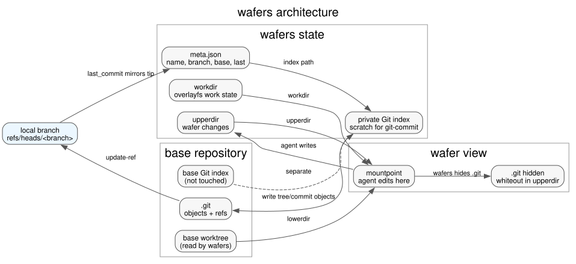
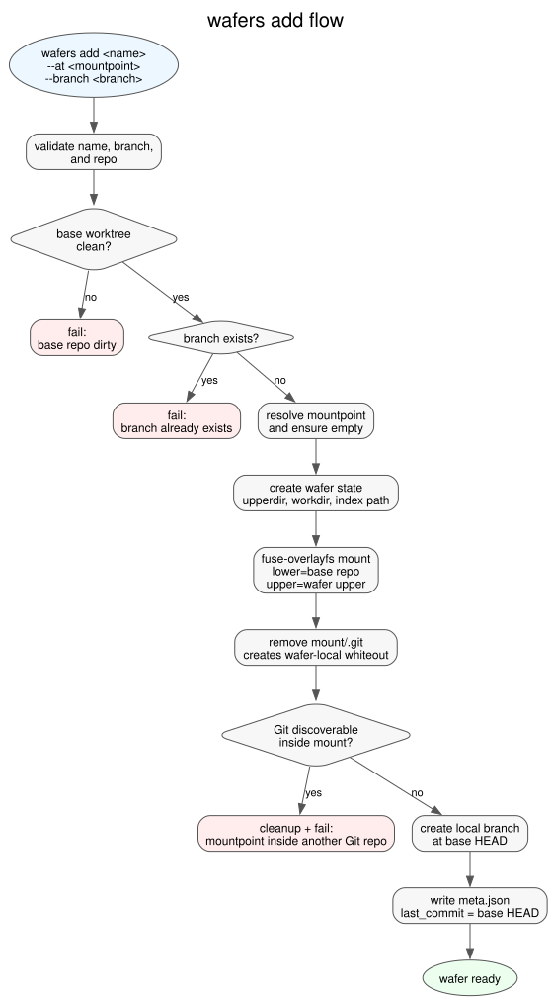
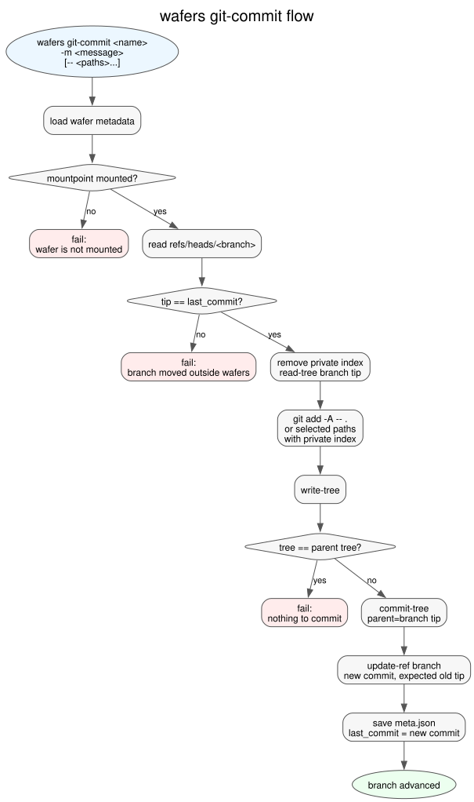

# wafers Design

`wafers` creates cheap, branch-backed working views of a Git repository for
parallel coding agents. The core idea is to separate three things that are often
mixed together in normal local development:

- the base checkout, which should remain untouched
- the agent's writable filesystem view
- the Git branch that receives the agent's result

The current implementation is intentionally narrow: Linux, `fuse-overlayfs`,
whole-wafer commits, and local branch refs. This document describes that design,
the invariants it depends on, and the likely extension points.

## Goals

- Let many agents fan out from one large checkout without full clones.
- Keep the base repo worktree and base repo index untouched.
- Give every wafer a normal local branch in the base repo.
- Make commits from the mounted wafer view without exposing `.git` there.
- Keep the tool understandable as a small CLI with Git-shaped behavior.

## Non-Goals

- `wafers` is not a sandbox or security boundary.
- It does not try to hide host files outside the wafer mountpoint.
- It does not currently support remote pushing, partial staging, submodule
  semantics, Git LFS semantics, non-Linux hosts, or non-FUSE backends.

## Architecture

The base repo is used as the `lowerdir` for `fuse-overlayfs`. Each wafer gets
its own `upperdir`, `workdir`, metadata file, and private Git index in wafers
state. The agent edits the mounted view. `wafers git-commit` uses Git plumbing
with `GIT_INDEX_FILE` pointed at the wafer-private index.

The base repo's object database and refs are used for output commits and branch
movement. The base repo's worktree and index are not used for wafer changes.



Graphviz source: [assets/architecture.dot](assets/architecture.dot).

Regenerate with:

```sh
dot -Tsvg docs/assets/architecture.dot -o docs/assets/architecture.svg
```

## State Layout

State lives under:

```text
$XDG_STATE_HOME/wafers
```

or, if `XDG_STATE_HOME` is unset:

```text
~/.local/state/wafers
```

Per-wafer state:

```text
wafers/
  lock
  wafers/
    <name>/
      meta.json
      upper/
      work/
      index
```

`meta.json` records:

- wafer name
- base repo path
- base Git dir
- base commit
- target branch
- mountpoint
- upperdir/workdir/index paths
- last commit expected at the branch tip
- timestamps

`last_commit` mirrors the branch tip that wafers expects. If the branch moves
outside wafers, `git-commit` refuses to overwrite it.

## `wafers add`

`wafers add` creates the filesystem view and the local branch.



Graphviz source: [assets/add-flow.dot](assets/add-flow.dot).

High-level flow:

1. Validate wafer name, branch name, repo, and mountpoint.
2. Refuse to continue if the requested local branch already exists.
3. Record the base repo root, Git dir, and current `HEAD`.
4. Create wafer state directories.
5. Mount `fuse-overlayfs` with:
   - `lowerdir = base repo`
   - `upperdir = wafer upperdir`
   - `workdir = wafer workdir`
6. Remove `.git` from the mounted view, creating wafer-local whiteout state.
7. Verify Git is not discoverable from the wafer mountpoint.
8. Create `refs/heads/<branch>` at the base commit.
9. Save metadata with `last_commit = base_commit`.

If setup fails after partial state is created, `add` attempts to unmount, remove
wafer state, and delete the branch if wafers created it.

## Why `.git` Is Hidden

Git discovers a repository by finding `.git` in the current directory or a
parent directory. Exposing the base repo's `.git` inside the wafer would invite
agents to run normal Git commands in the wafer and blur ownership of index and
refs.

`wafers` hides `.git` by deleting it from the mounted overlay immediately after
mounting. The delete is captured in the wafer upperdir as overlay whiteout
state. The base repo is not modified.

This is a usability guard, not a security boundary. A process can still run Git
explicitly against the base repo if it knows the path.

## `wafers git-commit`

`wafers git-commit` commits the whole mounted wafer view and advances the wafer
branch.



Graphviz source: [assets/git-commit-flow.dot](assets/git-commit-flow.dot).

Important properties:

- The wafer must be mounted.
- The current branch tip must equal `meta.last_commit`.
- The wafer-private index is scratch state and is rebuilt for each commit.
- Empty commits are refused.
- Branch updates are guarded with the expected old commit.

The core Git plumbing is:

```sh
GIT_INDEX_FILE=<wafer-index> \
git --git-dir=<base-git-dir> read-tree <branch-tip>

GIT_INDEX_FILE=<wafer-index> \
git --git-dir=<base-git-dir> \
    --work-tree=<wafer-mountpoint> \
    add -A -- .

GIT_INDEX_FILE=<wafer-index> \
git --git-dir=<base-git-dir> write-tree

git --git-dir=<base-git-dir> commit-tree <tree> -p <branch-tip> -m <message>

git --git-dir=<base-git-dir> \
    update-ref refs/heads/<branch> <new-commit> <branch-tip>
```

The final `update-ref` old-value argument makes the branch move atomic with
respect to external branch changes.

## Branch Ownership

`wafers add` creates the branch and refuses an existing branch. That gives each
wafer clear ownership of its branch from creation onward.

`wafers git-commit` reads the branch before creating the new commit. If the
branch tip is different from `meta.last_commit`, wafers assumes another process
or user moved it and fails rather than overwriting work.

`wafers rm` removes the mount and wafer state but keeps the local branch and
commits. This matches the Git mental model: removing a workspace should not
delete committed work.

## Concurrency Model

Wafers are independent at the filesystem level:

- each wafer has a separate `upperdir`
- each wafer has a separate `workdir`
- each wafer has a separate mountpoint
- each wafer has a separate private index
- each wafer should have a unique local branch

Mutating wafers commands take a global state lock under the wafers state root.
This serializes local wafers metadata mutations for the current user/state root.

Git object writes and ref updates happen in the shared base repo `.git`
directory. Git is designed to tolerate concurrent object writes and guarded ref
updates, but concurrent operations can still contend on Git lock files.

## Ignore Rules

`git-commit` runs `git add -A -- .` with the wafer mountpoint as `--work-tree`,
so normal worktree ignore rules apply:

- `.gitignore`
- nested `.gitignore` files
- tracked files are still updated even if they match ignore patterns

Because `--git-dir` points at the base repo's Git dir, Git config and
`info/exclude` from the base repo can also affect ignore behavior.

## Agent Guidance

`wafers skill` prints a generic Markdown skill file for agent runners:

```sh
wafers skill > SKILL.md
```

The skill teaches agents to:

- create one wafer per task
- work only inside the wafer mountpoint
- avoid Git commands inside the wafer
- commit through `wafers git-commit`
- push from the base repo
- clean up with `wafers rm`

## Failure Modes

Common failures and expected handling:

- Missing FUSE support: `wafers doctor` reports missing binaries, `/dev/fuse`,
  or mount capability.
- Mountpoint inside another Git repo: `add` fails because Git can still discover
  a parent `.git`.
- Branch already exists: `add` fails to avoid ambiguous branch ownership.
- Branch moved outside wafers: `git-commit` fails to avoid clobbering work.
- Nothing changed: `git-commit` fails with `nothing to commit`.
- Busy mount: `rm` fails if a process has its cwd or open files under the
  mountpoint; leave the mountpoint and retry.

## Testing Strategy

The default suite uses normal temp Git repos but avoids real FUSE mounts:

```sh
go test ./...
```

Linux/FUSE behavior is gated:

```sh
WAFERS_INTEGRATION=1 go test ./internal/cli -run TestIntegration -count=1
```

The Docker demo exercises the full stack:

```sh
docker compose -f demo/compose.yaml up --build --abort-on-container-exit
```

## Future Work

Likely extensions:

- `wafers git-status` for lifecycle and Git diff status
- `wafers git-diff`
- optional staging model with `wafers git-add`
- JSON output for orchestration
- remote push helper
- MCP server as a structured control plane
- rootless/container compatibility improvements
- support for submodules and Git LFS semantics
